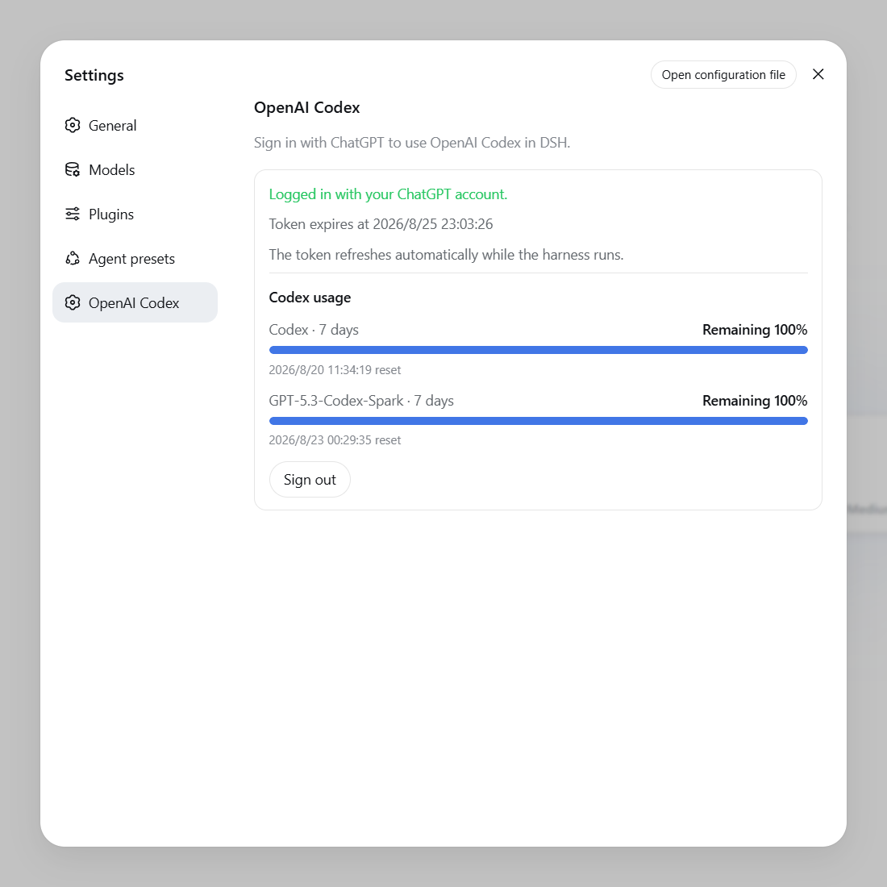

# dsh-openai-codex-auth

[简体中文](./README.zh-CN.md) | **English**

Adds an `openai-codex` model provider to
[DeepSeek Harness](https://github.com/deepseek-ai/deepseek-harness). Sign in
with an eligible ChatGPT subscription instead of an OpenAI Platform API key.

Only one plugin should own an LLM provider route. Enabling two implementations
of `openai-codex` causes an adapter registration conflict.

<p align="center">
  
</p>

## Features

- ChatGPT sign-in through the OpenAI Codex OAuth device-code flow.
- Codex models in the DSH model selector, with model-specific reasoning levels.
- Local credential storage and automatic token refresh.
- Login status, rolling usage windows, reset times, and Credits in Settings.

## Requirements

- Node.js `>=22.19.0`.
- A DSH `0.1.0-rc.6` Web profile that has been started at least once.
- A ChatGPT subscription eligible for Codex, with device-code sign-in enabled.

## Install or update

### From npm

Windows PowerShell:

```powershell
dsh plugin --profile web add dsh-openai-codex-auth

$dshRoot = if ($env:DSH_HOME) { $env:DSH_HOME } else { Join-Path $HOME ".dsh" }
node (Join-Path $dshRoot "profiles\node_modules\dsh-openai-codex-auth\install.mjs")
```

Linux or macOS:

```sh
dsh plugin --profile web add dsh-openai-codex-auth
node "${DSH_HOME:-$HOME/.dsh}/profiles/node_modules/dsh-openai-codex-auth/install.mjs"
```

### From source

```sh
npm install
dsh plugin --profile web add .
```

Then run the `install.mjs` command shown above for your platform. Set
`DSH_HOME` before these commands if DSH is not under `~/.dsh`.

The installer applies the Web settings entry required by DSH rc.6. It stops
before changing the profile if `openai-codex` already has another owner.
Restart DSH after installing or updating.

## Usage

1. Open **Settings → OpenAI Codex** and select **Sign in with ChatGPT**.
2. Open the verification page, enter the displayed device code, and authorize.
3. Select a model under **OpenAI Codex** in the model selector.

DSH agents can also call `codex_login`, `codex_status`, and `codex_logout`.

## Uninstall

Sign out under **Settings → OpenAI Codex** first, then run:

Windows PowerShell:

```powershell
$dshRoot = if ($env:DSH_HOME) { $env:DSH_HOME } else { Join-Path $HOME ".dsh" }
node (Join-Path $dshRoot "profiles\node_modules\dsh-openai-codex-auth\install.mjs") --uninstall
dsh plugin --profile web remove dsh-openai-codex-auth
```

Linux or macOS:

```sh
node "${DSH_HOME:-$HOME/.dsh}/profiles/node_modules/dsh-openai-codex-auth/install.mjs" --uninstall
dsh plugin --profile web remove dsh-openai-codex-auth
```

Restart DSH afterward.

## Security

- OAuth tokens are stored locally under `PI_OAUTH_OPENAI_CODEX` in
  `$DSH_HOME/.credentials.yaml` and are never sent to the settings page.
- Usage data retains only aggregate percentages, reset times, and Credits.
- Never commit or share `.credentials.yaml`, `auth.json`, or environment files.

Report security issues privately according to [SECURITY.md](./SECURITY.md).

## Development

```sh
npm run check
npm test
npm pack --dry-run
```

See [CONTRIBUTING.md](./CONTRIBUTING.md) before submitting changes.

## License

[MIT](./LICENSE)
