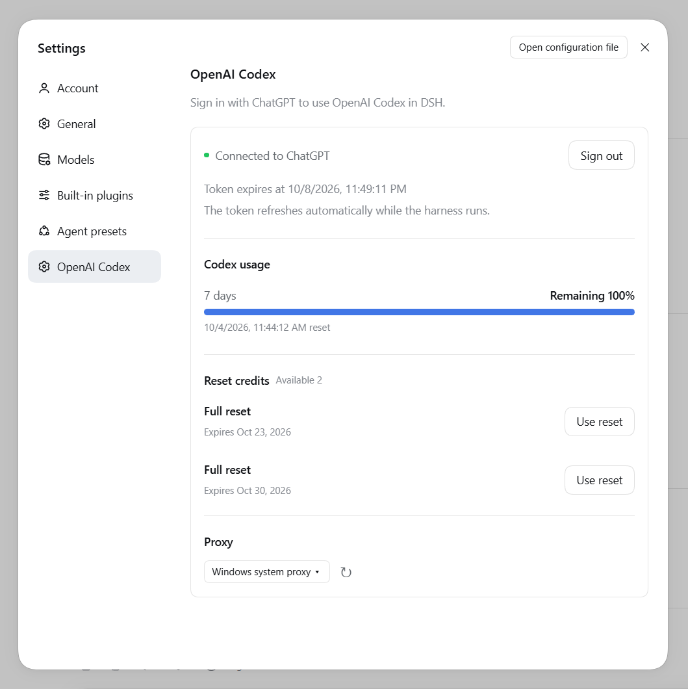

# dsh-openai-codex-auth

[简体中文](./README.zh-CN.md) | **English**

Adds an `openai-codex` model provider to
[DeepSeek Harness](https://github.com/deepseek-ai/deepseek-harness). Sign in
with an eligible ChatGPT subscription instead of an OpenAI Platform API key.

Only one plugin should own an LLM provider route. Enabling two implementations
of `openai-codex` causes an adapter registration conflict.

This includes DSH `0.2.0-rc.2`'s built-in `llm-pi-ai.providers.openai-codex`
route: do not configure it alongside this plugin. Coexistence is not supported;
enabling both prevents this plugin from activating.

<p align="center">
  
</p>

## Features

- ChatGPT sign-in through the OpenAI Codex OAuth device-code flow.
- Codex models in the DSH model selector, with model-specific reasoning levels.
- Local credential storage and automatic token refresh.
- Login status, rolling usage windows, reset times, and Credits in Settings.

## Requirements

- Node.js `>=22.19.0`.
- A DSH `0.2.0-rc.2` Web profile (the tested host version).
- A ChatGPT subscription eligible for Codex, with device-code sign-in enabled.

Models come from the host's pi-ai catalog. DSH `0.2.0-rc.2` ships pi-ai
`0.87.1`, which includes GPT-6 Sol and GPT-6 Luna. Model availability still depends on your account. This plugin does not
replace the host's model catalog or install a second provider runtime.

## Install or update

```sh
dsh plugin --profile web add dsh-openai-codex-auth
```

Restart DSH after installing or updating.

### Windows Desktop

Desktop `0.2.0-rc.2` carries its own DSH runtime and uses the separate `desktop`
profile. Installing into `web` does not install into Desktop. Keep
`dsh.client.platform: web`: Desktop renders the same Web plugin UI.

Open Desktop once to initialize its profile, then **fully quit it**, including
the tray process, before using its bundled CLI from PowerShell:

```powershell
$desktopDsh = "$env:LOCALAPPDATA\Programs\DeepSeek Harness\resources\runtime\cli\bin\dsh.cmd"
& $desktopDsh plugin --profile desktop add dsh-openai-codex-auth
```

Adjust the path for a custom installation. Do not substitute an npm-installed
`dsh` for this command. Restart Desktop and open **Settings → OpenAI Codex**.
Use the same CLI with `plugin --profile desktop remove dsh-openai-codex-auth`
to uninstall after fully quitting Desktop.

Plugin `0.5.0` targets DSH `0.2.0-rc.2`. For DSH `0.1.7-rc.2`, use plugin
`0.4.2` instead. Do not bypass compatibility checks.

Validation covers isolated installation, the bundled Desktop runtime and Web
settings/RPC. Native Electron window interactions and real OAuth/model requests
are not part of the automated verification.

### From source

```sh
npm install
dsh plugin --profile web add .
```

The package is a DSH bundle, so no separate install script is required.

## Usage

1. Open **Settings → OpenAI Codex** and select **Sign in with ChatGPT**.
2. Open the verification page, enter the displayed device code, and authorize.
3. Select a model under **OpenAI Codex** in the model selector.

DSH agents can also call `codex_login`, `codex_status`, and `codex_logout`.

### Network proxy

Model, sign-in, and usage requests use DSH's shared `fetch` transport. Configure
`HTTPS_PROXY` / `HTTP_PROXY` / `ALL_PROXY` and `NO_PROXY` before starting DSH,
or in `$DSH_HOME/.env`. This plugin does not read Windows system proxy settings
or install its own global dispatcher. Restart DSH after changing proxy settings.

For example, in PowerShell (replace the address with your proxy):

```powershell
$env:HTTPS_PROXY = "http://127.0.0.1:7897"
dsh web
```

## Uninstall

Sign out under **Settings → OpenAI Codex** first, then run:

```sh
dsh plugin --profile web remove dsh-openai-codex-auth
```

Restart DSH afterward.

## Security

- OAuth tokens are stored locally under `PI_OAUTH_OPENAI_CODEX` in
  `$DSH_HOME/.credentials.yaml` and are never sent to the settings page.
- Usage data retains only aggregate percentages, reset times, and Credits.
- Never commit or share `.credentials.yaml`, `auth.json`, or environment files.

Report security issues privately according to [SECURITY.md](./SECURITY.md).

## Development

```sh
npm run check
npm test
npm pack --dry-run
```

See [CONTRIBUTING.md](./CONTRIBUTING.md) before submitting changes.

## License

[MIT](./LICENSE)
