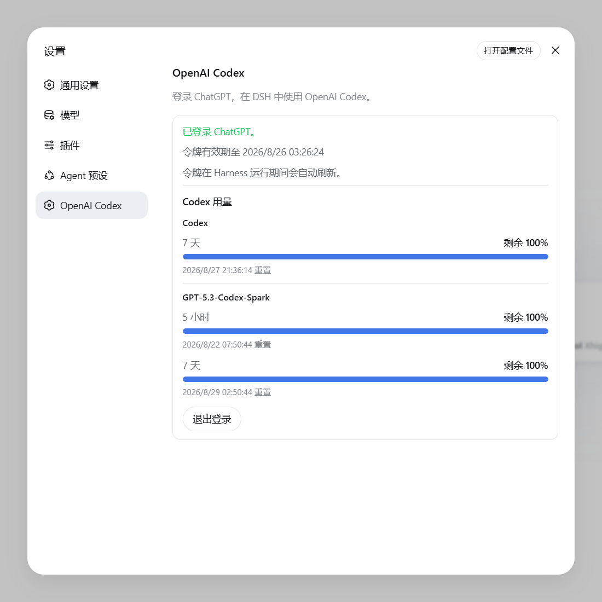

# dsh-openai-codex-auth

**简体中文** | [English](./README.md)

为 [DeepSeek Harness](https://github.com/deepseek-ai/deepseek-harness) 增加
`openai-codex` 模型提供方，通过符合资格的 ChatGPT 订阅登录，无需配置 OpenAI
Platform API Key。

一个 LLM provider 路由应当只由一个插件负责。同时启用两个 `openai-codex` 实现会造成
adapter 注册冲突。

<p align="center">
  
</p>

## 功能

- 使用 OpenAI Codex OAuth 设备码流程登录 ChatGPT；
- 在 DSH 模型选择器中提供 Codex 模型及对应推理等级；
- 在本地保存凭据并自动刷新令牌；
- 在设置页显示登录状态、滚动用量周期、重置时间和 Credits。

## 要求

- Node.js `>=22.19.0`；
- DSH `0.1.1-rc.2` Web profile；
- 具有 Codex 使用资格并已启用设备码登录的 ChatGPT 订阅。

## 安装或更新

```sh
dsh plugin --profile web add dsh-openai-codex-auth
```

安装或更新后重启 DSH。

### 从源码安装

```sh
npm install
dsh plugin --profile web add .
```

这个包本身就是 DSH bundle，不需要再执行安装脚本。

## 使用

1. 打开“设置 → OpenAI Codex”，选择“使用 ChatGPT 登录”；
2. 打开验证页面，输入显示的设备码并完成授权；
3. 在模型选择器的“OpenAI Codex”下选择模型。

DSH agent 也可以调用 `codex_login`、`codex_status` 和 `codex_logout`。

## 卸载

先在“设置 → OpenAI Codex”中退出登录，然后运行：

```sh
dsh plugin --profile web remove dsh-openai-codex-auth
```

最后重启 DSH。

## 安全

- OAuth token 以 `PI_OAUTH_OPENAI_CODEX` 项保存在本地
  `$DSH_HOME/.credentials.yaml`，不会发送到设置页面；
- 用量数据只保留聚合百分比、重置时间和 Credits；
- 请勿提交或分享 `.credentials.yaml`、`auth.json` 或环境变量文件。

安全问题请按 [SECURITY.md](./SECURITY.md) 私下报告。

## 开发

```sh
npm run check
npm test
npm pack --dry-run
```

提交改动前请阅读 [CONTRIBUTING.md](./CONTRIBUTING.md)。

## License

[MIT](./LICENSE)
