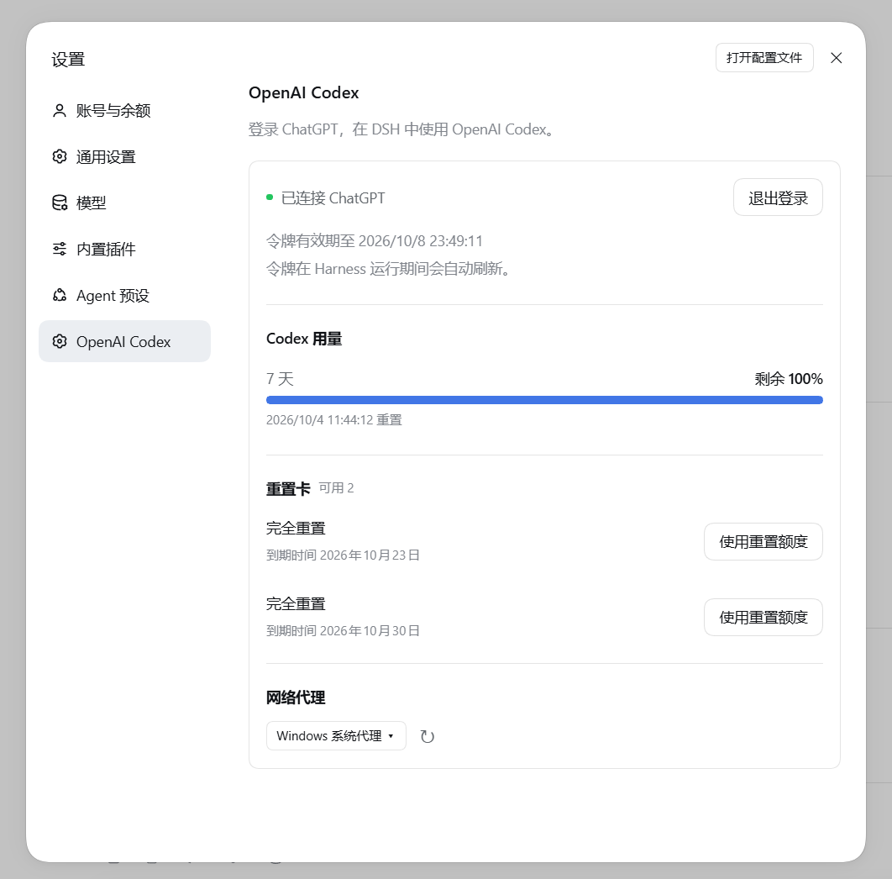

# dsh-openai-codex-auth

**简体中文** | [English](./README.md)

为 [DeepSeek Harness](https://github.com/deepseek-ai/deepseek-harness) 增加
`openai-codex` 模型提供方，通过符合资格的 ChatGPT 订阅登录，无需配置 OpenAI
Platform API Key。

一个 LLM provider 路由应当只由一个插件负责。同时启用两个 `openai-codex` 实现会造成
adapter 注册冲突。

DSH `0.2.0-rc.2` 的内置 `llm-pi-ai.providers.openai-codex` 路由也受此限制：
使用本插件时不要同时配置该内置路由。共存尚不支持，同时启用会导致插件无法激活。

<p align="center">
  
</p>

## 功能

- 使用 OpenAI Codex OAuth 设备码流程登录 ChatGPT；
- 在 DSH 模型选择器中提供 Codex 模型及对应推理等级；
- 在本地保存凭据并自动刷新令牌；
- 在设置页显示登录状态、滚动用量周期、重置时间和 Credits。

## 要求

- Node.js `>=22.19.0`；
- DSH `0.2.0-rc.2` Web profile（已测试的宿主版本）；
- 具有 Codex 使用资格并已启用设备码登录的 ChatGPT 订阅。

模型来自宿主的 pi-ai 目录。DSH `0.2.0-rc.2` 自带的 pi-ai `0.87.1`
已包含 GPT-6 Sol 和 GPT-6 Luna，实际访问权限仍取决于账号；插件不会替换宿主目录或安装另一套 provider 运行时。

## 安装或更新

```sh
dsh plugin --profile web add dsh-openai-codex-auth
```

安装或更新后重启 DSH。

### Windows 桌面版

桌面版 `0.2.0-rc.2` 内置独立的 DSH 运行时，使用 `desktop` profile。
安装到 `web` 不会自动安装到桌面版。插件仍使用 `dsh.client.platform: web`，
因为桌面版复用 Web 插件界面。

先打开一次桌面版以初始化 profile，再**完全退出（包括托盘进程）**，
然后在 PowerShell 中调用桌面版自带 CLI：

```powershell
$desktopDsh = "$env:LOCALAPPDATA\Programs\DeepSeek Harness\resources\runtime\cli\bin\dsh.cmd"
& $desktopDsh plugin --profile desktop add dsh-openai-codex-auth
```

自定义安装位置需调整路径，不要用 npm 全局安装的 `dsh` 代替该命令。
重启桌面版后打开“设置 → OpenAI Codex”。卸载时同样先完全退出桌面版，
再用该 CLI 执行 `plugin --profile desktop remove dsh-openai-codex-auth`。

插件 `0.5.0` 面向 DSH `0.2.0-rc.2`；仍使用 DSH `0.1.7-rc.2` 的用户
请安装插件 `0.4.2`。不要绕过兼容性检查。

已验证隔离安装、桌面内置运行时及 Web 设置页/状态接口；
原生 Electron 窗口交互、真实 OAuth 和模型请求不在自动验证范围内。

### 从源码安装

```sh
npm install
dsh plugin --profile web add .
```

这个包本身就是 DSH bundle，不需要再执行安装脚本。

## 使用

1. 打开“设置 → OpenAI Codex”，选择“使用 ChatGPT 登录”；
2. 打开验证页面，输入显示的设备码并完成授权；
3. 在模型选择器的“OpenAI Codex”下选择模型。

DSH agent 也可以调用 `codex_login`、`codex_status` 和 `codex_logout`。

### 网络代理

模型、登录和用量请求统一使用 DSH 的 `fetch` 网络传输。请在启动 DSH 前配置
`HTTPS_PROXY` / `HTTP_PROXY` / `ALL_PROXY` 和 `NO_PROXY`，或写入
`$DSH_HOME/.env`。插件不再读取 Windows 系统代理，也不再设置全局连接管理器。
修改代理设置后需要重启 DSH。

例如在 PowerShell 中（请替换为你的代理地址）：

```powershell
$env:HTTPS_PROXY = "http://127.0.0.1:7897"
dsh web
```

## 卸载

先在“设置 → OpenAI Codex”中退出登录，然后运行：

```sh
dsh plugin --profile web remove dsh-openai-codex-auth
```

最后重启 DSH。

## 安全

- OAuth token 以 `PI_OAUTH_OPENAI_CODEX` 项保存在本地
  `$DSH_HOME/.credentials.yaml`，不会发送到设置页面；
- 用量数据只保留聚合百分比、重置时间和 Credits；
- 请勿提交或分享 `.credentials.yaml`、`auth.json` 或环境变量文件。

安全问题请按 [SECURITY.md](./SECURITY.md) 私下报告。

## 开发

```sh
npm run check
npm test
npm pack --dry-run
```

提交改动前请阅读 [CONTRIBUTING.md](./CONTRIBUTING.md)。

## License

[MIT](./LICENSE)
